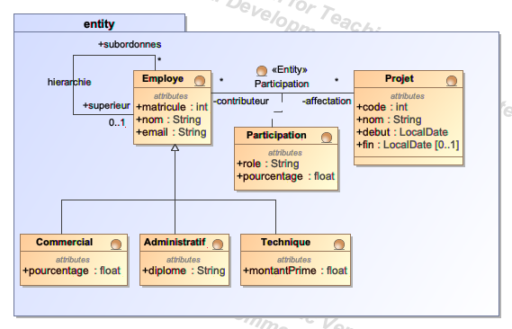

# Mise en œuvre d'un modèle conceptuel de données en JPA

A partir de ce point de départ, vous devez implémenter en JPA le modèle conceptuel de données (MCD) suivant, qui reprend l'exercice "Organisation des projets" traité en UML au premier semestre.

## Modèle Conceptuel de Données

## Instructions

Pour mettre en œuvre ce modèle en JPA, suivez les étapes suivantes :

1. **Création des entités JPA :** Pour chaque entité identifiée dans le MCD, créez une classe Java correspondante en utilisant l'annotation `@Entity`. Assurez-vous de définir correctement les attributs et les associations entre les entités, en respectant les relations illustrées dans le MCD. Pour chaque entité, définissez une clé primaire à l'aide de l'annotation `@Id`.

2. **Configuration des relations :** Utilisez les annotations JPA appropriées pour configurer les relations entre vos entités. Par exemple, `@OneToMany`, `@ManyToOne`, `@ManyToMany`, et `@OneToOne`, selon les cas. Vous pouvez examiner le schéma relationnel généré par JPA en lançant l'application et en ouvrant la [console d'administration H2](http://localhost:8989).
 
3. **Initialisation des tables :** Initialisez votre base de données avec des données de test. Pour cela, utilisez le fichier `data.sql` qui se trouve dans le répertoire `src/main/resources`. Ce fichier contient des instructions SQL pour insérer des données dans votre base de données. Vous devez donner quelques exemples de chaque entité pour tester votre implémentation.

4. **Requête :** Ajoutez à l'endroit approprié une méthode java qui, pour un employé connu par son matricule, calcule son pourcentage total de participation dans les projets en cours. Un projet est en cours si sa date de fin n'est pas renseignée. Cette méthode doit être implémentée en utilisant une requête SQL ou JPQL.

5. **Test :** Ajouter un test unitaire pour la méthode ci-dessus. Votre fichier data.sql doit être conçu pour tester efficacement cette méthode.
